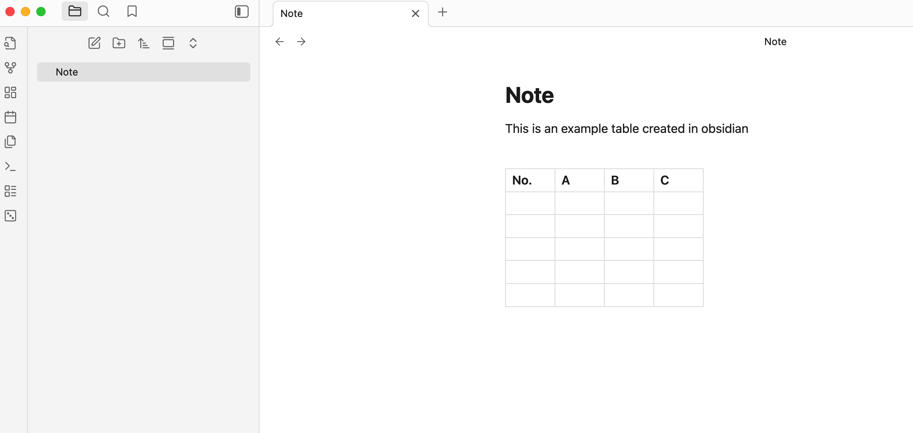
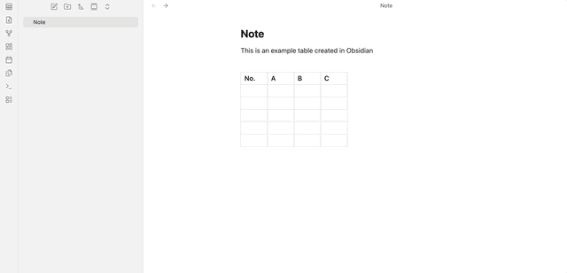
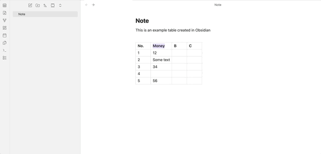
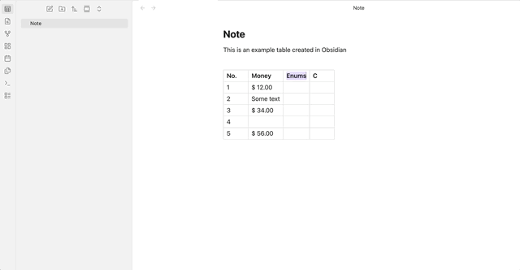

# obsidian-tables-plus

# Overview
This plugin creates a ribbon-button that pops open a modal when the user highlights the header text in a table cell. This modal can be used to set the column types.

📝 _Note: Currently, the type setting needs to be re-done to auto-populate any newly added rows. I will add setting persistance to new rows in the future if obsidian or code-mirror make it possible._

#### Features: Column Data Types
Table headings can be defined as specific types to enforce formatting:

- Index: Automatically indexes the column rows.
- Money: Formats numbers as currency. Supports user-defined currency symbols.
- Enum: Converts cells into dropdown selectors with pre-defined options. This ensures data consistency for columns like "Status" or "Priority."
📝 _Note: Dropdown selection currently functions only in Live Preview. Changes made there will be visible, but not interactive, in Reading View._

# Usage
1. Create a table and fill in the headers

2. Highlight the text inside the table header
3. While the text is highlighted, click on the tables plus icon on your ribbon actions toolbar to open a modal
4. Select your option

**Modal Options**

- Indexing: Select index and click outside the table for the plugin to auto-populate your index column

- Money: Select a currency or add your own. Click outside the table for currency formatting. This will only work in cells that have numbers.

- Enums: Once you add the enums, the options field in the code-block will be auto-updated with your entered enum. You can edit your enums via this code block or through the modal. The edit icon will turn into a button once you're inside the table cell. This button will turn into a dropdown menu that can be used to easily select any option.

⚠️ _Please do not delete this block as it will delete all enum settings for your table. If you plan to edit the block directly for enum options, please make sure to follow the proper YAML syntax (no tabs)_

## Additional features I may add in the future:
- More Types (Dates etc.)
- Integration with dataview - types can be interpreted as metadata to be fed into dataview
- Filtering - Filter the table to display by enum types to display only the rows with that particular enum
