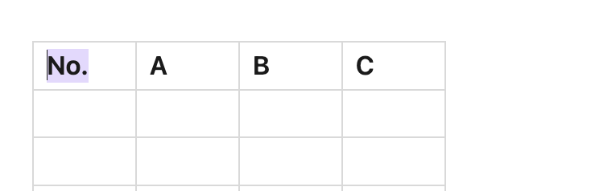

<h1 align="center">
obsidian-tables-plus
</h1>

<h2 align="center">Obsidian Tables Plus</h2>

## Overview
This plugin creates a ribbon-button that pops open a modal when the user highlights the header text in a table cell. This modal can be used to set the column types.
_Note: Currently, the type setting needs to be re-done to auto-populate any newly added rows but this will not erase any of your pre-existing data. I will add setting persistance to new rows in the future. I reccommend keeping the table-config because the plugin will most likely use this to create persistance._

#### Feature 1: Auto-categorizing columns: Table headings can be defined as types 
    - Current Types
        - Index: Auto-indexes the columns 
        - Money: Formats any numbers as any currency. Also accepts user-defined currency symbols.
        - Enum: Pre-defined options for any table column, turning cells into a dropdown selector. Generally used for columns like "Status" or "Priority" where you want to ensure consistent data entry and prevent typos. Note: The selection change does not currently persist in reading view (will reset if the view is switched back) but works in live preview to persist beyond view changes
    - Future
        - Dates
        - Etc.

# Usage
    1. Create a table and fill in the headers
    

    2. Highlight the text inside the table header
    

    3. While the text is highlighted, click on the tables plus icon on your ribbon actions toolbar to create a table-config code block open a modal. If you don't plan on using enums, you can delete this code block but I reccommend keeping it for future backward compatibility.

        - Indexing: Select index and click outside the table for the plugin to auto-populate your index column

        - Money: Select a currency or add your own. Click outside the table for currency formatting. This will only work in cells that have numbers.

        - Enums: Once you add the enums, the options field in the code-block will be auto-updated with your entered enum. You can edit your enums via this code block or through the modal. The edit icon will turn into a button once you're inside the table cell. This button will turn into a dropdown menu that can be used to easily select any option.

## Additional Features to be Added in the Future (if there's a demand):
    - Integration with dataview - types can be interpreted as metadata to be fed into dataview
    - Filtering - Filter the table to display by enum types to display only the rows with that particular enum
